# OpenShamrock部署

本文记录了 OpenShamrock 如何在 Windows 电脑的雷电模拟器9（部署时采用9.0.61）中部署

并使OpenShamrock连接到原有的 Hoshinobot 之类的 WebSocket nonobot11 后端，提供服务

本文使用 LSPosed-zygisk + KitsuneMask 部署

本文部署时间 2023/12/23， 注意版本

## 需求材料

- QQ 8.9.68+ APK
- MT文件管理器
- Magisk-v24+
    - Kitsune Mask 版本 https://github.com/HuskyDG/magisk-files/releases
    - 或原始 Magisk https://github.com/topjohnwu/Magisk/releases
    - Riru https://github.com/RikkaApps/Riru/releases
- LSPosed-zygisk-xxx.zip 或 LSPosed-riru-xxx.zip
  - https://github.com/LSPosed/LSPosed/releases/
- LSPatch : 理论上和 LSPosed相同
  - https://github.com/LSPosed/LSPatch/releases/
- Shamrock-xxx.zip
  - https://github.com/whitechi73/OpenShamrock
- LSPatch：免Root版本的，基于 LSPosed 核心的 LSPosed 框架实现，理论上安装了 LSPosed-zygisk 就行

基本结构

- Magisk 是一个基于 root 的系统hook框架，截取了系统的许多接口，对外打包提供服务，支持按照模块加载
  - 主要负责对设备进行 Root，并且对外包装接口
  - 使用原版 Magisk 或者 KitsuneMask
- Zygisk 和 Riru 是 Magisk 的高层封装
  - Zygisk = Magisk in Zygote，对外提供功能接口的同时，使用 MagiskHide 将后端框架从系统应用列表中隐藏，从而防止应用主动发起检测
  - Zygisk 由 Magisk 提供，通过模组安装
  - Riru 类似 https://github.com/RikkaApps/Riru/releases
- LSPosed 和 XPosed 是 Magisk 的模块，对功能进行了再次封装
  - XPosed 已经停止维护，最多支持 Android 8
  - LSPosed 正在积极维护，支持到 Android 14
- LSPatch 是 LSPosed-Zygisk 的替代，理论上本次部署流程无需安装
- Shamrock 是 Nonebot11 的实现，参考 go-cqhttp，通过 LSPosed 提供的功能，对 QQ 进行消息的中途截取和处理

## 雷电模拟器部署

- 设置模拟器
  - 设置 System.vmdk 可写入
  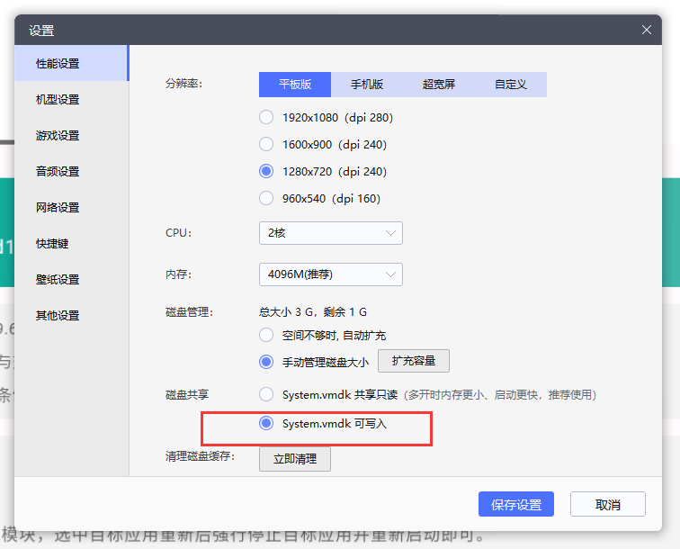
  - 开启 Root
  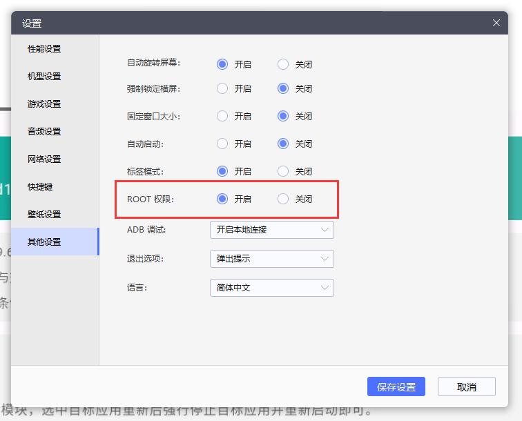
- 安装软件
  - QQ 8.9.68+
  - Magisk/KitsuneMask
  - Shamrock
  - MT管理器
- 配置Magisk
  - 允许 Root
  - 安装 Magisk 框架到安卓系统文件夹
    - 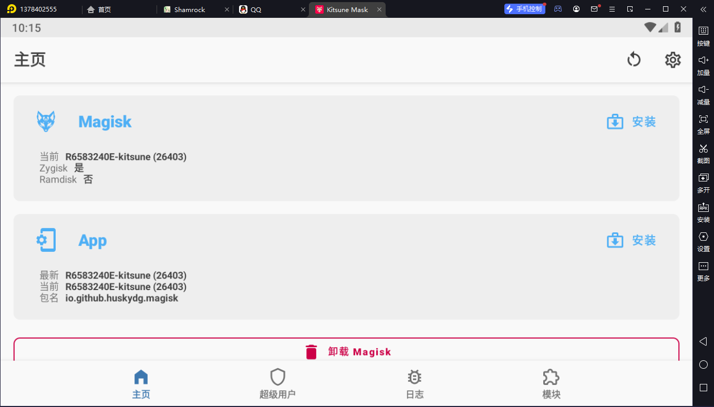
    - 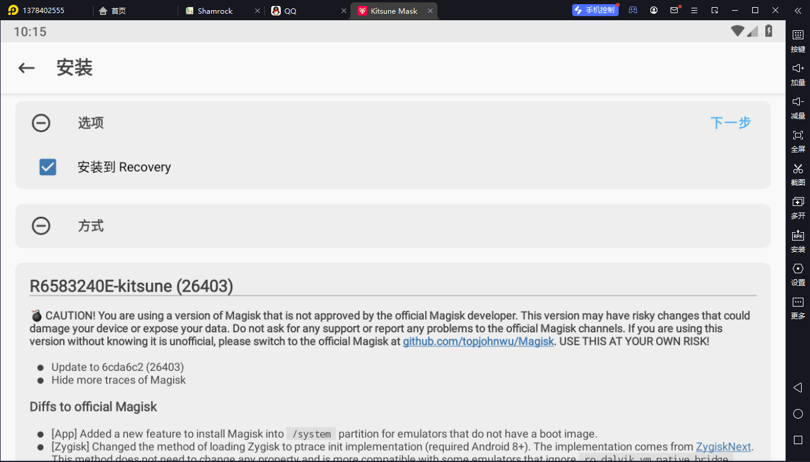
    - 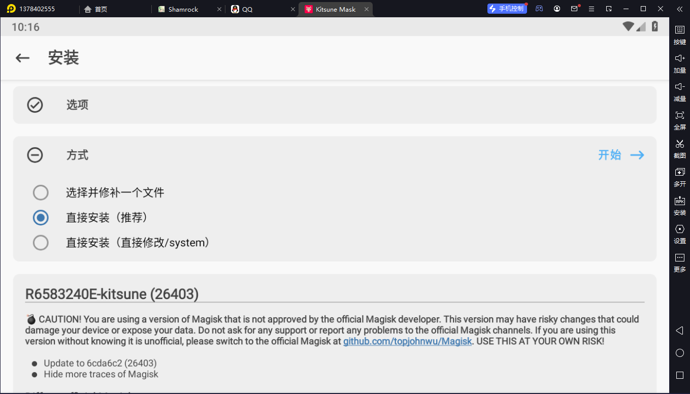
  - 重启模拟器
  - 如果提示“检测到有其他Root应用的sh”云云，不用管，也可以去删除原有的 sh 文件，但是没什么影响，无所谓
  - 完成后看到 Zygisk=是
    - 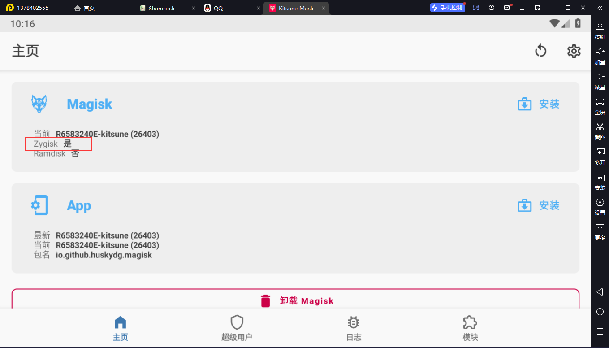
  - 通过模拟器共享文件夹拷贝 LSPosed-Zygisk.zip 和 Shamrock.zip 到安卓文件夹
    - 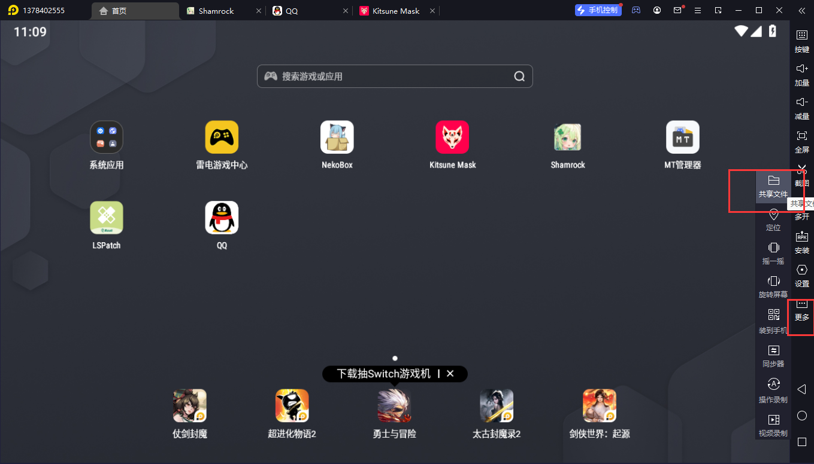
    - 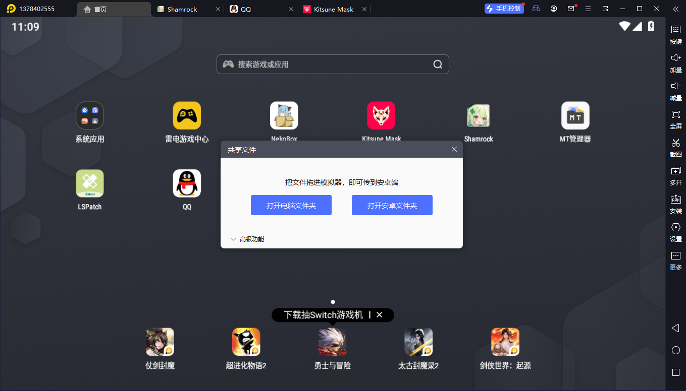
  - 安装 LSPosed-Zygisk
    - 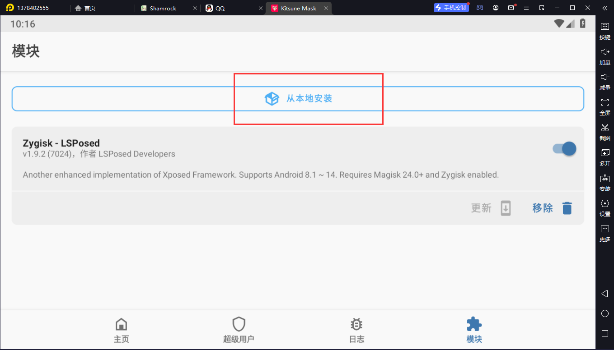
    - 启用模块，重启模拟器
- 配置 LSPosed
  - 从 LSPosed-Zygisk.zip 中解压出 manager.apk，安装
  - 下拉通知栏可以看到 LSPosed 管理器
    - 
  - 启用 Shamrock 模块
    - 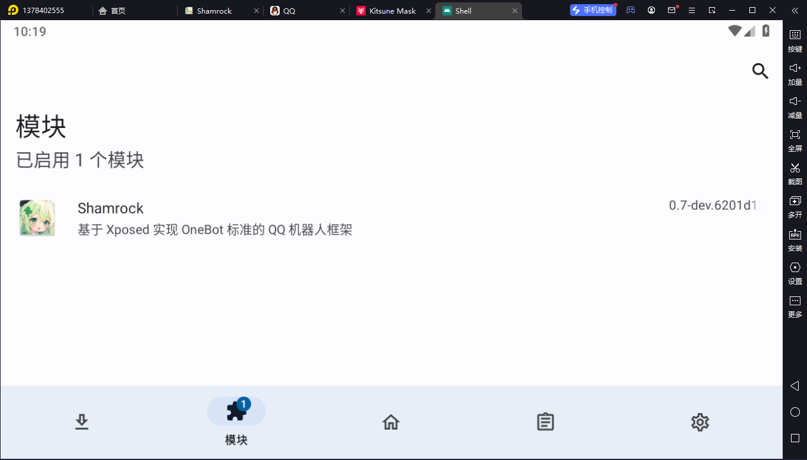
  - 勾选 QQ 应用，允许 Shamrock 注入QQ
    - 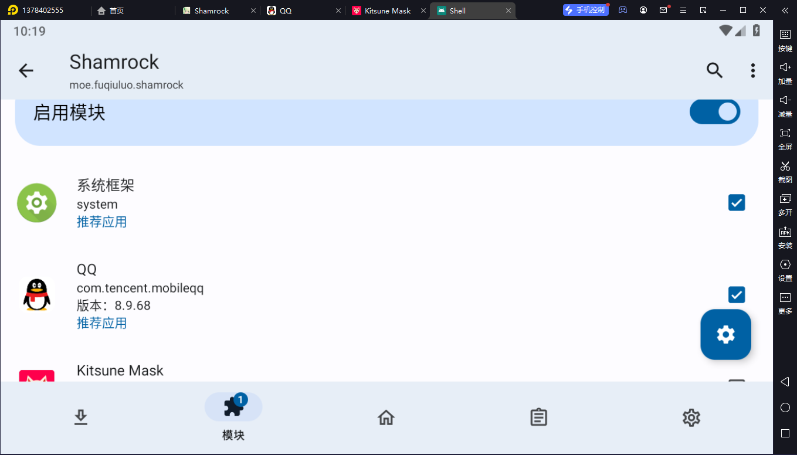
- 配置QQ
  - 登录QQ账号
- 配置 Shamrock
  - 被动 WebSocket 地址：Shamrock本身是一个客户端，连接到传统的 Hoshinobot 或者 yobot 服务器
    - 鉴权Token就是加了一个 Authorization 头
    - 目标服务器如果在 nginx 后的，注意加上 Proxy 相关的 Upgrade 设置
      ```
      location / {
          proxy_set_header X-Forwarded-For $proxy_add_x_forwarded_for;
          proxy_set_header Host $host;
          proxy_pass http://ws-backend;
          proxy_http_version 1.1;
          proxy_set_header Upgrade $http_upgrade;
          proxy_set_header Connection "upgrade";
      }
      ```
  - 强制平板模式，保证手机可以同时登录QQ
  - 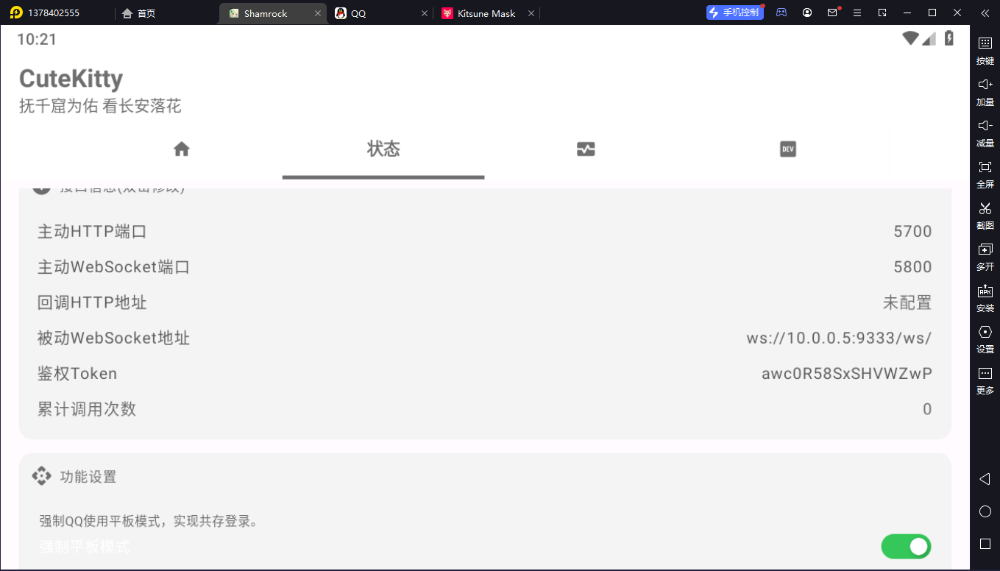
  - 主动 WebSocket 是Shamrock本身监听一个端口，需要使用 adb 把端口映射到本机，才能让外界调用
  - 回调 HTTP 地址是另一种单独的信息处理，轮询代替长连接
- 启动机器人
  - 保证 Magisk 正常加载
  - 保证 LSPosed 模块本身在 Magisk 中正常， LSPosed 里的 Shamrock 模块正常
  - 彻底杀掉QQ进程
  - 打开 Shamrock，应该是未激活状态
  - 打开QQ，显示Toast说明Shamrock已激活，切回Shamrock，状态变成已激活，查看日志，测试功能